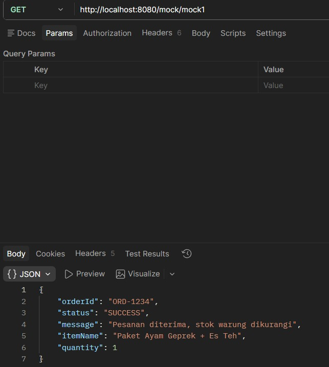
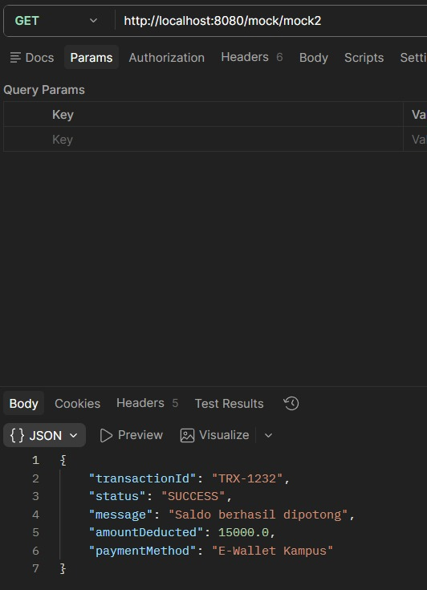
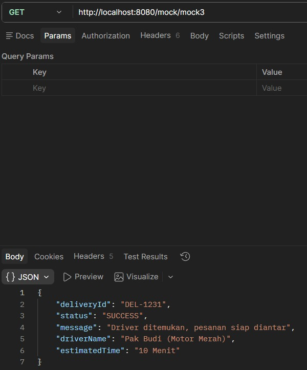
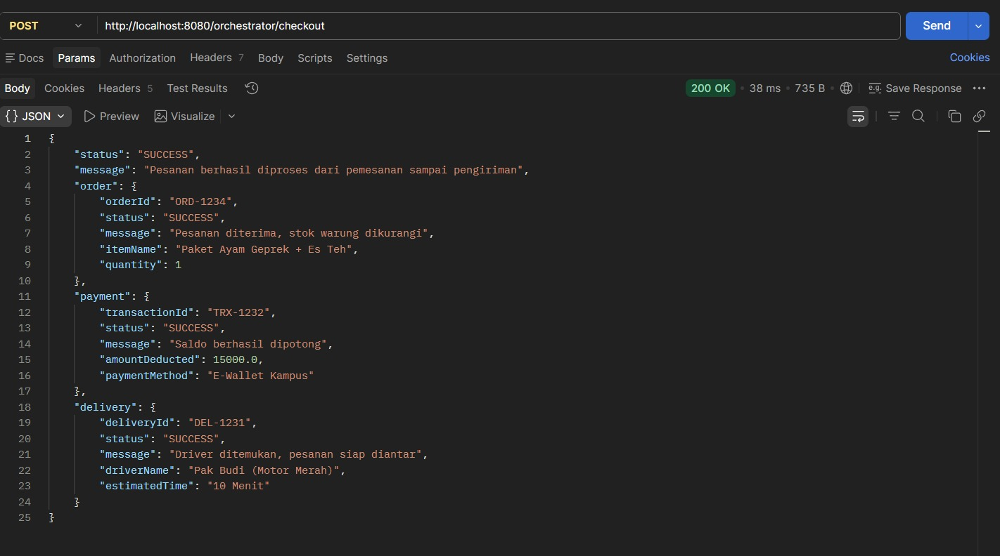
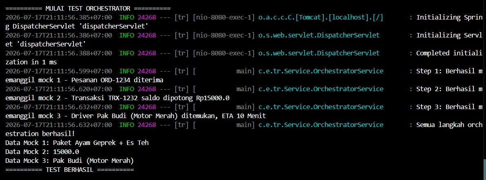
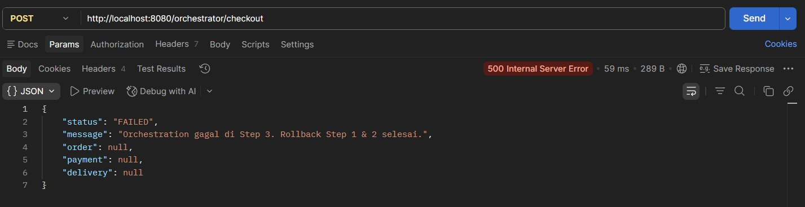
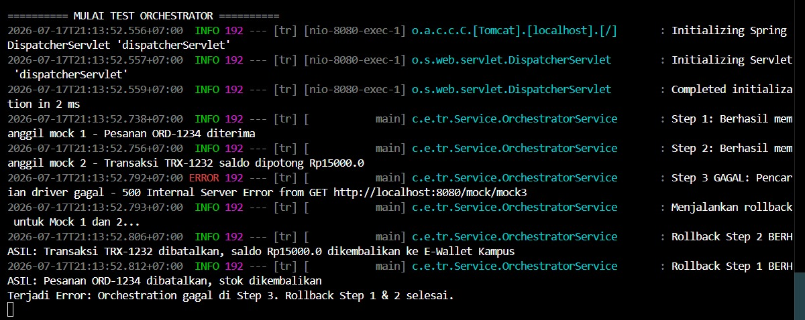

# 🍔 TR Web Service — Orchestration & Saga (Topik 3)

Layanan simulasi pemesanan makanan yang mendemonstrasikan pola **Orchestration**
dan **Saga (Compensating Transaction)** menggunakan **Spring Boot + WebClient**.


---

## 📌 Alur Proses

```
Client -> POST /orchestrator/checkout
              |
              v
   Step 1: /mock/mock1  -> Pemesanan (kurangi stok warung)
              |
              v
   Step 2: /mock/mock2  -> Pembayaran (potong saldo e-wallet)
              |
              v
   Step 3: /mock/mock3  -> Pengiriman (cari driver)
              |
              v
   Response JSON gabungan (order + payment + delivery)
```

Jika salah satu step gagal, service akan otomatis menjalankan **rollback**
(compensating transaction) untuk step-step sebelumnya yang sudah berhasil,
dengan urutan terbalik:

- Gagal di Step 2 → rollback Step 1
- Gagal di Step 3 → rollback Step 2, lalu rollback Step 1

---

## 🗂️ Struktur Project

| Komponen                  | Keterangan                                                          |
|----------------------------|----------------------------------------------------------------------|
| `MockController`           | 3 endpoint tiruan (`/mock/mock1`, `/mock2`, `/mock3`) + endpoint rollback |
| `WebClientConfig`          | Konfigurasi WebClient untuk memanggil endpoint mock                 |
| `OrchestratorService`      | Menjalankan step 1–3 secara berurutan + logic saga rollback         |
| `OrchestratorController`   | Endpoint utama untuk client, mengagregasi hasil 3 step jadi 1 JSON  |
| `SharedDto`                | Wadah data antar step selama proses orchestration berjalan          |
| `OrchestrationResponse`    | DTO hasil akhir yang dikembalikan ke client                         |

---

## ▶️ Cara Menjalankan

```bash
cd tr
./mvnw spring-boot:run
```

Aplikasi berjalan di `http://localhost:8080`

---

## 🧪 Cara Uji (Postman / curl)

### Endpoint individual (mock)

Masing-masing step bisa dites secara terpisah lewat endpoint mock-nya:

**`GET /mock/mock1`** — simulasi pemesanan



**`GET /mock/mock2`** — simulasi pembayaran



**`GET /mock/mock3`** — simulasi pengiriman



### Endpoint utama — skenario sukses

**Request:**
```
POST http://localhost:8080/orchestrator/checkout
```

**Response sukses (200 OK):**



```json
{
  "status": "SUCCESS",
  "message": "Pesanan berhasil diproses dari pemesanan sampai pengiriman",
  "order": {
    "orderId": "ORD-1234",
    "status": "SUCCESS",
    "message": "Pesanan diterima, stok warung dikurangi",
    "itemName": "Paket Ayam Geprek + Es Teh",
    "quantity": 1
  },
  "payment": {
    "transactionId": "TRX-1232",
    "status": "SUCCESS",
    "message": "Saldo berhasil dipotong",
    "amountDeducted": 15000.0,
    "paymentMethod": "E-Wallet Kampus"
  },
  "delivery": {
    "deliveryId": "DEL-1231",
    "status": "SUCCESS",
    "message": "Driver ditemukan, pesanan siap diantar",
    "driverName": "Pak Budi (Motor Merah)",
    "estimatedTime": "10 Menit"
  }
}
```

Log terminal saat semua step berhasil:



---

## 🔄 Cara Uji Skenario Gagal (Saga Rollback)

Skenario ini menguji kegagalan di **Step 3**, sehingga Step 1 dan Step 2 yang
sudah berhasil akan di-*rollback* secara otomatis (compensating transaction).

**Response gagal (500 Internal Server Error):**



```json
{
  "status": "FAILED",
  "message": "Orchestration gagal di Step 3. Rollback Step 1 & 2 selesai.",
  "order": null,
  "payment": null,
  "delivery": null
}
```

Log terminal membuktikan urutan rollback berjalan terbalik (Step 2 dulu,
baru Step 1):



Dari log terlihat urutan eksekusi:

1. `Step 1: Berhasil memanggil mock 1` — Pesanan ORD-1234 diterima
2. `Step 2: Berhasil memanggil mock 2` — Transaksi TRX-1232, saldo dipotong Rp15000.0
3. `Step 3 GAGAL` — Pencarian driver gagal (500 Internal Server Error)
4. `Menjalankan rollback untuk Mock 1 dan 2...`
5. `Rollback Step 2 BERHASIL` — Transaksi TRX-1232 dibatalkan, saldo dikembalikan
6. `Rollback Step 1 BERHASIL` — Pesanan ORD-1234 dibatalkan, stok dikembalikan

### Cara mereproduksi skenario gagal

1. Buka `src/main/resources/application.properties`
2. Tambahkan/ubah baris berikut agar salah satu step gagal (misalnya
   dengan mengarahkan base URL ke port yang salah, atau mengaktifkan mode
   simulasi gagal di Step 2/3):
   ```properties
   orchestrator.mock-base-url=http://localhost:9999
   ```
3. Jalankan ulang aplikasi (`./mvnw spring-boot:run`) lalu panggil
   `POST /orchestrator/checkout` di Postman
4. Perhatikan **response** (status `FAILED`) dan **log di terminal**
   yang menunjukkan proses rollback berjalan
5. Kembalikan lagi konfigurasi di langkah 2 (hapus/comment) supaya
   aplikasi kembali normal

---

## 👥 Anggota Kelompok — Topik 3

| No. | Tugas |
|-----|-------|
| 1   | Mock Endpoint & WebClient config |
| 2   | Orchestration Step 1 & 2 |
| 3   | Orchestration Step 3 |
| 4   | Saga & Compensating Transaction |
| 5   | Agregasi hasil & Dokumentasi |
